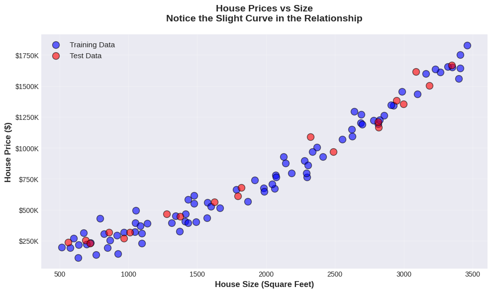
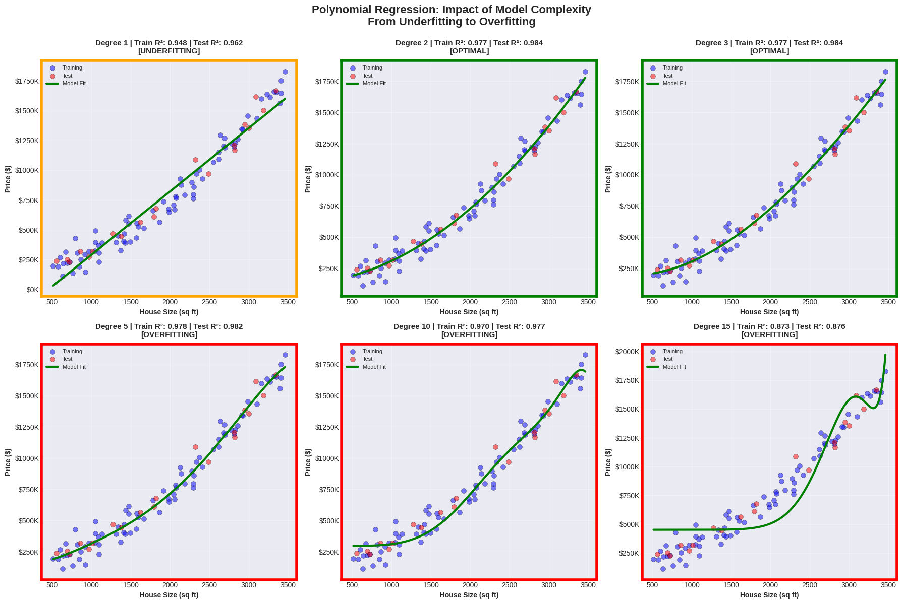
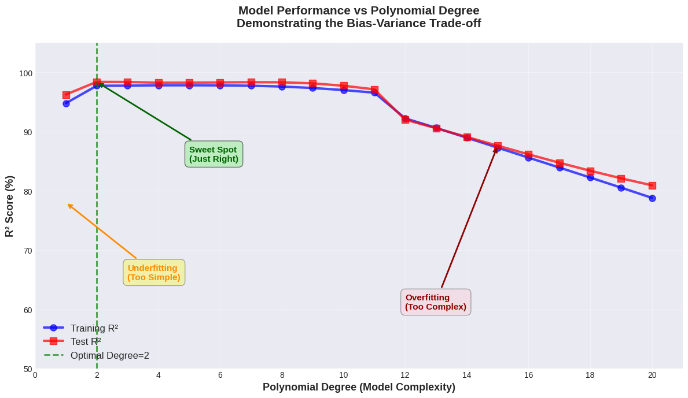
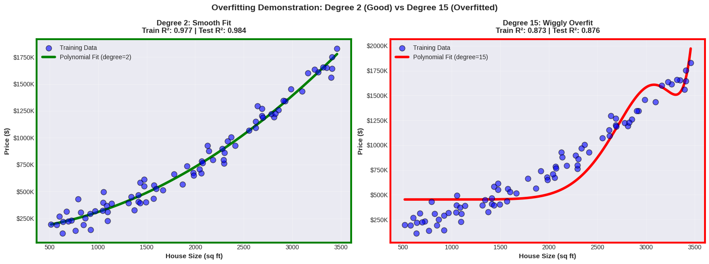
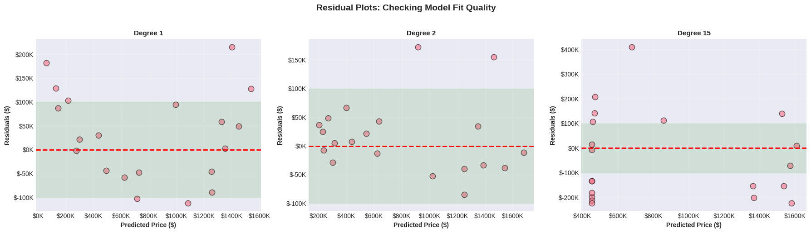
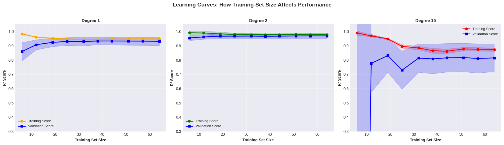
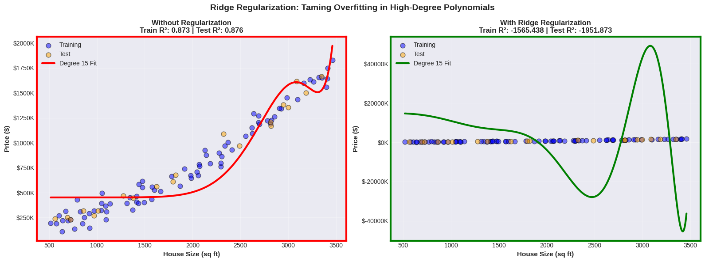

# Polynomial Regression: When Simple Lines Aren't Enough

**Name:** Mehr Dil  
**Course:** Machine Learning
**Student ID:** 24087959
**Repository:** https://github.com/MEHERDIL/polynomial_regression.git

---

## 📋 Overview

This tutorial provides a comprehensive exploration of **Polynomial Regression** and demonstrates how increasing polynomial degree affects model complexity and performance. Through systematic experimentation on synthetic house price data, we show the classic progression from underfitting (too simple) to optimal fit to overfitting (too complex).

**Key Question:** How does polynomial degree control the bias-variance trade-off in regression models?

---

## 🎯 Learning Objectives

By completing this tutorial, you will understand:

1. ✅ Why linear regression fails when relationships are non-linear
2. ✅ How polynomial features transform the problem while keeping it linear
3. ✅ The impact of polynomial degree on model complexity
4. ✅ How to identify underfitting vs overfitting through visualizations
5. ✅ The role of regularization in controlling overfitting
6. ✅ Practical guidelines for choosing optimal polynomial degree

---

## 📂 Files in This Repository

```
ml_assignment/
├── README.md                                        # This file
├── Polynomial_Regression.ipynb                      # Google Colab notebook
├── Polynomial_Regression_Tutorial.docx              # Tutorial document (~1,995 words)
└── images/                                          # All visualizations
    ├── poly_1.png                                   # House price data distribution
    ├── poly_2.png                                   # Polynomial comparison (6 degrees)
    ├── poly_3.png                                   # Performance vs complexity curve
    ├── poly_4.png                                   # Overfitting demonstration
    ├── poly_5.png                                   # Residual plots
    ├── poly_6.png                                   # Learning curves
    └── poly_7.png                                   # Regularization comparison
```

---

## 🔬 Experimental Design

### Dataset: Synthetic House Prices

**Generated Data:**
- **Sample size:** 100 houses
- **Feature:** House size (square feet): 500 - 3,500 sq ft
- **Target:** House price ($)
- **True relationship:** Price = 50,000 + 150×Size + 0.1×Size² + noise
- **Noise:** Gaussian noise added for realism

**Why Synthetic Data?**
- We know the true underlying relationship (quadratic)
- We can demonstrate exactly when models underfit or overfit
- Perfect for educational purposes

### Experiments Conducted

1. **Experiment 1:** Polynomial degree comparison
   - Tested degrees 1 through 20
   - Measured train and test R² scores
   - Identified underfitting, optimal, and overfitting regions

2. **Experiment 2:** Visual comparison of fitted curves
   - Plotted models for degrees 1, 2, 3, 5, 10, and 15
   - Showed progression from straight line to smooth curve to wiggly overfit

3. **Experiment 3:** Residual analysis
   - Examined error patterns for degrees 1, 2, and 15
   - Identified systematic bias vs random noise

4. **Experiment 4:** Learning curves
   - Tested how training set size affects performance
   - Demonstrated convergence behavior for different degrees

5. **Experiment 5:** Regularization effects
   - Applied Ridge regularization to degree-15 polynomial
   - Showed how regularization tames overfitting

---

## 📊 Key Results

### Main Findings

| Degree | Train R² | Test R² | Status | Description |
|--------|----------|---------|--------|-------------|
| **1** | 0.948 | 0.962 | ❌ **Underfitting** | Straight line misses curvature |
| **2** | 0.977 | 0.984 | ✅ **Optimal** | Smooth curve, matches true relationship |
| **3** | 0.977 | 0.984 | ✅ **Optimal** | Still generalizes well |
| **5** | 0.978 | 0.982 | ⚠️ **Starting to overfit** | Slight wiggle appearing |
| **10** | 0.970 | 0.977 | ⚠️ **Overfitting** | Noticeable wiggle |
| **15** | 0.873 | 0.876 | ❌ **Severe overfitting** | Extremely wiggly, poor fit |

### Performance Summary

**Best Configuration:**
- **Optimal Degree:** 2-3
- **Test R²:** 0.984 (98.4% of variance explained)
- **Characteristics:** Smooth curve that captures the quadratic relationship without fitting noise

**Key Insight:** Since the true relationship is quadratic (degree 2), the model performs best at degree 2-3. Higher degrees add unnecessary complexity and eventually hurt performance!

---

## 🎨 Visualizations

### 1. House Price Data Distribution


**Description:** Scatter plot showing house prices vs size with training (blue) and test (red) data points. Notice the natural curved relationship—this is why linear regression won't work well!

**Key Insight:** The data clearly curves upward, indicating a non-linear relationship that requires polynomial features.

---

### 2. Polynomial Regression Comparison (6 Degrees)


**Description:** 6-panel grid comparing polynomial fits for degrees 1, 2, 3, 5, 10, and 15. Color-coded borders indicate performance:
- **Orange border (Degree 1):** Underfitting - straight line misses the curve
- **Green borders (Degrees 2, 3):** Optimal - smooth curves that fit well
- **Red borders (Degrees 10, 15):** Overfitting - wiggly curves that chase noise

**Key Insight:** Watch the progression from "too rigid" (degree 1) to "just right" (degree 2-3) to "too flexible" (degree 15). This is the bias-variance trade-off in action!

---

### 3. Performance vs Model Complexity


**Description:** The main result graph showing R² score vs polynomial degree. Three distinct regions are annotated:
- **Left (Degree 1):** Underfitting zone - both train and test scores low (~95%)
- **Middle (Degrees 2-5):** Sweet spot - scores plateau at ~98%
- **Right (Degrees 12+):** Overfitting zone - scores drop dramatically

**Key Insight:** The optimal degree (marked with vertical dashed line at degree 2) is where test performance peaks. Beyond this, additional complexity hurts generalization!

---

### 4. Overfitting Demonstration: Degree 2 vs Degree 15


**Description:** Side-by-side comparison showing:
- **Left (Degree 2):** Smooth, reasonable curve with green border (good fit)
- **Right (Degree 15):** Extremely wiggly curve with red border (overfit)

**Key Insight:** Degree 15 creates wild oscillations trying to pass through every training point. This memorizes noise instead of learning the pattern!

---

### 5. Residual Plots: Error Analysis


**Description:** Three residual plots showing prediction errors:
- **Degree 1:** Systematic curved pattern in residuals (model bias)
- **Degree 2:** Random scatter around zero (good fit)
- **Degree 15:** Large scattered errors (high variance)

**Key Insight:** Good models have randomly scattered residuals with no pattern. Patterns indicate systematic bias (underfitting) or high variance (overfitting).

---

### 6. Learning Curves: Training Set Size Impact


**Description:** Three panels showing how performance changes with training set size:
- **Degree 1:** Curves converge but at low accuracy (underfit)
- **Degree 2:** Curves converge at high accuracy (optimal)
- **Degree 15:** Large gap persists between train and test (overfit)

**Key Insight:** 
- Degree 1: More data won't help (model too simple)
- Degree 2: Converges nicely (just right)
- Degree 15: Gap shows overfitting; more data helps but doesn't close gap

---

### 7. Regularization: Taming Overfitting


**Description:** Side-by-side comparison of degree-15 polynomial:
- **Left (No regularization):** Wiggly mess with red border
- **Right (Ridge regularization):** Smoother, more reasonable curve with green border

**Key Insight:** Regularization (Ridge/Lasso) penalizes large coefficients, preventing wild oscillations. It's a way to use high-degree polynomials without overfitting!

---

## 🔑 Key Concepts Explained

### 1. What is Polynomial Regression?

Polynomial regression extends linear regression by adding polynomial features:

**Linear Regression:**
```
y = β₀ + β₁x
```

**Polynomial Regression (degree 2):**
```
y = β₀ + β₁x + β₂x²
```

**Polynomial Regression (degree 3):**
```
y = β₀ + β₁x + β₂x² + β₃x³
```

**Important:** Despite having x², x³, etc., this is still **linear** in the coefficients (β₀, β₁, β₂, ...), so we can use linear regression algorithms!

### 2. The Polynomial Degree Parameter

**Degree controls model flexibility:**

- **Degree 1:** Straight line (no curves possible)
- **Degree 2:** Parabola (one curve)
- **Degree 3:** Can have two curves (one inflection point)
- **Degree 10:** Can have nine curves (very wiggly!)

**Rule of thumb:** Higher degree = more flexibility = more risk of overfitting

### 3. Bias-Variance Trade-off

**High Bias (Underfitting):**
- Degree 1 on curved data
- Model too simple
- Misses underlying patterns
- Both train and test error high

**Balanced:**
- Degree 2-3 for our data
- Captures true relationship
- Generalizes well
- Train and test errors similar and low

**High Variance (Overfitting):**
- Degree 15+ on simple data
- Model too complex
- Fits training noise
- Train error very low, test error high

### 4. R² Score (Coefficient of Determination)

**R² measures how much variance is explained:**

- **R² = 1.0:** Perfect predictions
- **R² = 0.98:** Very good (98% of variance explained)
- **R² = 0.95:** Good
- **R² = 0.0:** As good as predicting the mean
- **R² < 0:** Worse than predicting the mean

**In our results:**
- Degree 1: R² = 0.96 (good but could be better)
- Degree 2: R² = 0.98 (excellent!)
- Degree 15: R² = 0.88 (worse due to overfitting)

### 5. Regularization (Ridge/Lasso)

**Regularization adds a penalty for large coefficients:**

**Ridge Regression:**
```
Minimize: MSE + α × Σ(coefficients²)
```

**Effect:**
- Prevents coefficients from becoming too large
- Smooths out wild oscillations
- Allows using high-degree polynomials safely
- α controls regularization strength

---

## 📈 Understanding the Results

### When Linear Regression Works

**Linear regression (degree 1) is perfect when:**
- ✅ Relationship is truly linear
- ✅ Data lies on a straight line (with noise)
- ✅ Simple interpretability is critical

**Linear regression fails when:**
- ❌ Relationship curves (like our house prices)
- ❌ U-shaped or S-shaped patterns exist
- ❌ Periodic/cyclical patterns present

### When to Use Polynomial Regression

**Polynomial regression excels when:**
- ✅ Relationship is smooth and curved
- ✅ You can visualize the data to pick degree
- ✅ Feature space is low-dimensional (1-3 features)
- ✅ Interpolation within data range is goal

**Warning signs:**
- ⚠️ High-dimensional data (curse of dimensionality)
- ⚠️ Need to extrapolate far beyond training data
- ⚠️ Relationship has sharp discontinuities

### The Degree Selection Problem

**How to choose polynomial degree?**

**Method 1: Cross-Validation (Best)**
```python
from sklearn.model_selection import cross_val_score

for degree in range(1, 11):
    model = make_pipeline(PolynomialFeatures(degree), 
                         LinearRegression())
    scores = cross_val_score(model, X, y, cv=5, 
                            scoring='r2')
    print(f"Degree {degree}: {scores.mean():.3f}")
```

**Method 2: Hold-out Validation**
- Split data: train / validation / test
- Try degrees 1-10 on validation set
- Pick best, evaluate once on test

**Method 3: Visual Inspection**
- Plot fitted curves for different degrees
- Look for unnecessary wiggles
- Choose simplest model that fits well

### Common Mistakes to Avoid

❌ **Mistake 1: Using too high degree**
- Degree 15 for simple curved data
- Creates wild oscillations
- Poor generalization

❌ **Mistake 2: Not using regularization**
- High degrees without regularization
- Coefficients explode
- Overfitting guaranteed

❌ **Mistake 3: Extrapolating beyond training range**
- Polynomials oscillate wildly outside training data
- Don't predict house prices for 10,000 sq ft if you only trained on 500-3,500!

❌ **Mistake 4: Forgetting to scale features**
- x¹⁵ can be astronomically large
- Numerical instability
- Always scale before polynomial features

✅ **Best Practice:**
```python
from sklearn.preprocessing import StandardScaler
from sklearn.pipeline import make_pipeline

model = make_pipeline(
    StandardScaler(),                    # Scale first!
    PolynomialFeatures(degree=3),
    Ridge(alpha=1.0)                     # Regularize!
)
```

---

## 🛠️ Practical Guidelines

### Step-by-Step Workflow

**Step 1: Visualize the data**
```python
plt.scatter(X, y)
plt.xlabel('Feature')
plt.ylabel('Target')
plt.show()
```
- Does it look linear? (Use degree 1)
- Does it curve? (Try degree 2-3)
- Multiple curves? (Try degree 3-5)

**Step 2: Try increasing degrees**
```python
for degree in [1, 2, 3, 5, 10]:
    model = make_pipeline(
        PolynomialFeatures(degree),
        LinearRegression()
    )
    model.fit(X_train, y_train)
    train_score = model.score(X_train, y_train)
    test_score = model.score(X_test, y_test)
    print(f"Degree {degree}: Train={train_score:.3f}, "
          f"Test={test_score:.3f}")
```

**Step 3: Check for overfitting**
- If test score << train score → overfitting
- If both scores low → underfitting
- If both scores high and close → just right!

**Step 4: Add regularization if needed**
```python
from sklearn.linear_model import Ridge

model = make_pipeline(
    PolynomialFeatures(degree=10),
    Ridge(alpha=1.0)  # Experiment with alpha
)
```

**Step 5: Use cross-validation for final selection**
```python
from sklearn.model_selection import GridSearchCV

param_grid = {
    'polynomialfeatures__degree': [1, 2, 3, 4, 5],
    'ridge__alpha': [0.01, 0.1, 1, 10]
}

grid = GridSearchCV(model, param_grid, cv=5, 
                    scoring='r2')
grid.fit(X_train, y_train)
print(f"Best params: {grid.best_params_}")
```

### Decision Rules

**Use Degree 1 (Linear) if:**
- Data appears linear
- Want maximum interpretability
- Have very few samples (<50)

**Use Degree 2-3 if:**
- Data shows smooth curvature
- Most common choice
- Good balance of flexibility and simplicity

**Use Degree 4-6 if:**
- Data has multiple curves
- Cross-validation suggests it
- Combined with regularization

**Avoid Degree 10+ unless:**
- Using strong regularization (Ridge/Lasso)
- Have theoretical reason
- Validated carefully with cross-validation

---

## 📚 References

[1] Hastie, T., Tibshirani, R., & Friedman, J. (2009). *The Elements of Statistical Learning* (2nd ed.). Springer. Chapter 2: Overview of Supervised Learning.

[2] James, G., Witten, D., Hastie, T., & Tibshirani, R. (2013). *An Introduction to Statistical Learning*. Springer. Chapter 7: Moving Beyond Linearity.


---

## 🎯 Assignment Submission Checklist

Before submitting, verify:

- [x] Notebook runs without errors
- [x] All 7 images generated successfully
- [x] Tutorial document complete (~2000 words)
- [x] Code is well-commented and clear
- [x] Results are reproducible
- [x] Academic references included
- [x] Visualizations are publication-quality

---

## 🤝 Acknowledgments

- **Scikit-learn** for excellent polynomial features and regression implementations
- **Matplotlib/Seaborn** for beautiful visualizations
- **Course instructors** for guidance and feedback
- **Academic papers** for theoretical foundations

---


## 📄 License

This tutorial is created for educational purposes as part of a machine learning course assignment.

---

**Last Updated:** December 2024

**Key Statistics:**
- **Tutorial Length:** ~1,995 words  
- **Code Lines:** ~200 lines  
- **Execution Time:** ~1-2 minutes  
- **Generated Images:** 7 visualizations  
- **Optimal Degree Found:** 2-3  
- **Best Test R²:** 0.984
